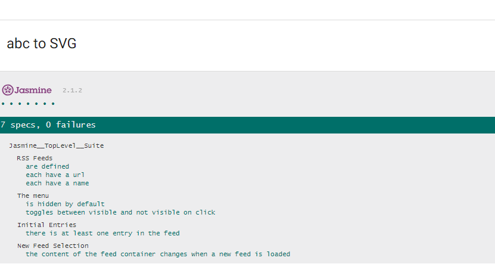
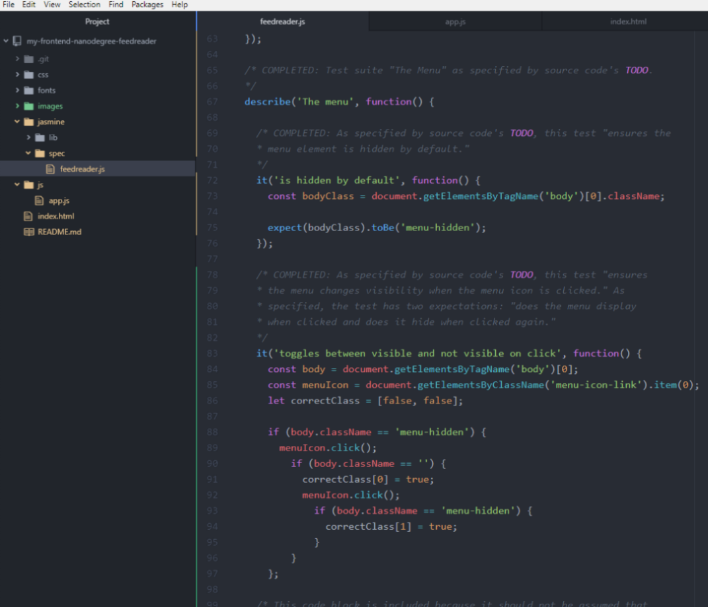
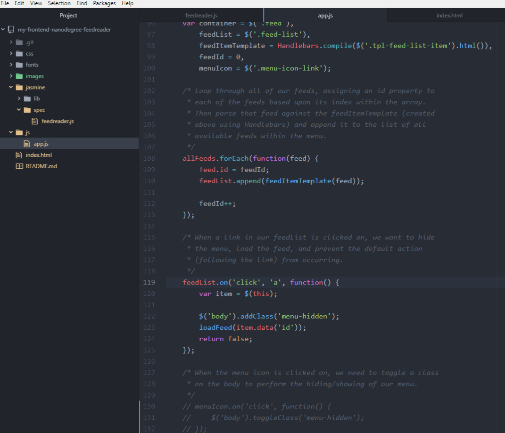
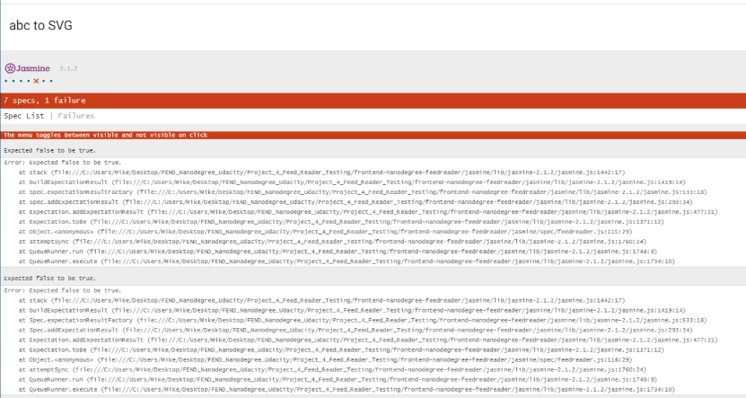

# Feed Reader Testing Project | Udacity FEND | 2018

Project 4 for Udacity's Front-End Web Developer Nanodegree program; completed as part of the Grow with Google Scholarship Program, 2018.

In this project, students were asked to finish filling out the provided `feadreader.js` file set up to be run by the testing framework Jasmine, a product of Pivotal Labs. Student developers were tasked with completing a series of TODO's included in `feedreader.js` that specified various test suites and tests to be run against a provided feed reader web application. The first test suite `RSS Feeds` and its first test `it('are defined', ... )` were provided by Udacity as part of the source code for this project.

The remainder of the files, including the HTML markup, CSS stylesheets, fonts and `app.js` files for the feed reader application were
furthermore provided by Udacity as part of the source code, which also included the Jasmine 2.1.2 library.

## Authors

Jacob W. Olson filled out specified portions of this project's `feedreader.js` file in accordance with the instructions given in a series of TODO's provided by Udacity. This task involved writing various suites and tests to run against the web application to confirm the proper functionality of various features it came with. Particular sources for pieces of the code are noted in the comments of `feedreader.js`, and sources are also referenced in the "Acknowledgments" section of this README, below.

A portion of the code and most of the comments in `jasmine.js` were provided by Udacity, as noted in the file. The remainder of the project's code was also provided by Udacity.

## Getting Started

1. Clone the repository to create a copy on your local machine. Click [here](https://help.github.com/articles/cloning-a-repository/ "GitHub Help — Clone a Repository") for help with this task from GitHub.

2. Open `index.html` in your browser. Some tips for doing this from Help Desk Geek are available [here](https://helpdeskgeek.com/how-to/open-an-html-file-in-google-chrome/ ).

## Viewing test results and diving deeper

1. Scroll to the bottom of the page to see a list of test "suites" that each describe a different portion of the application in black font. Each suite is followed by a sublist describing one or more tests or "specs" the Jasmine file is running against the parts of the application described by its corresponding suite.

  * "Spec" is short for "specification," and each spec's description is written in the form of a statement that 'specifies' how the part of the application described by the spec's suite should perform.

  * All specs should be passing when you first load the page, and thus should all display in green font. You will also see a counter at the top of the Jasmine display section listing how many specs are being run, and how many of those are failing — you should see seven specs with zero failing when you first open index.html in a browser window.

2. Now, in your favorite code editor, open up `feadreader.js` and check out what is being tested for by comparing the code in the suites and specs with the web app's HTML, CSS and `app.js` files.

  * See if you can figure out how the suites and specs are written. Hint: you can start by spotting the descriptions of the suites and tests displayed in the Jasmine section of the application's page in the code! If you are new to Jasmine, you may wish to check out [this article](https://dev.to/aurelkurtula/unit-testing-with-jasmine-the-very-basics-74k) from DEV as one resource for help understanding what's going on in the `feedreader.js` file. You may also wish to check out [Jasmine 2.2's documentation on GitHub](https://jasmine.github.io/2.2/introduction.html).

  * If you don't have a code editor installed on your machine, [Atom](https://atom.io/) is free and recommended as an option.

3. Once you start to grasp what the specs are testing for in relation to the rest of the app's code, make some of the tests fail, then fix them. Do this by editing the code in `app.js` or any other file in a manner you think will cause the 'expected' conditions in one or more of the specs to not be met. You can also experiment with editing the specs themselves.

  * Be sure to save your files after making your edits. Then, refresh the browser window `index.html` is open in, and scroll to the bottom of the page.

  * If you successfully "broke" the some of functionality being tested for, or changed one or more of the tests in such a way that the code no longer meets the expectation(s), the specs you attempted to cause fail should now be displayed in red. What's more, the number of tests now failing should be listed in the top banner of the Jasmine display section.

  * You can dig in to details about the failure in the lines below the spec description.

4. After you are done experimenting with editing the code and causing tests to fail, go back and make everything work again! 🙂

  * You should now have a better understanding of how some of the code in the feed reader application works and, if you were unfamiliar with the topic before, more skills and knowledge around the basics of testing code with Jasmine. Nice work!

## Acknowledgements

* As previously noted, Udacity provided the source code for this project, including the HTML, the CSS files, `app.js` file, fonts, a starter README file with notes for students about the project and its purpose, and a starter for the `feedreader.js` file, including some initial code, which is marked with comments in the file. The starter `feedreader.js` file included a series of TODO's to guide student developers through the process of completing the project.

  * Also as previously noted, the source code included the Jasmine 2.1.2 library, which is used to run the tests.

  * You can access the repository for the project's source code [on GitHub](https://github.com/udacity/frontend-nanodegree-feedreader).

* Portions of Udacity student Matthew Cranford's series of "Feedreader Walkthrough" posts were consulted: https://matthewcranford.com/. In particular, the post [Part 1 — Starter Code](https://matthewcranford.com/feed-reader-walkthrough-part-1-starter-code/) was consulted to gain a better understanding of the provided code before digging in. Furthermore, the section of the post ["Part 4 — Async Tests"](https://matthewcranford.com/feed-reader-walkthrough-part-4-async-tests/) where Cranford demonstrates an effective way to use the `done()` function in conjunction with `beforeEach()` to run a test involving the asynchronous `loadFeed()` function was consulted.

* The article "Using Jasmine 2.0's New Done Function to Test Asynchronous Processes" [posted at HTML Goodies](https://www.htmlgoodies.com/beyond/javascript/stips/using-jasmine-2.0s-new-done-function-to-test-asynchronous-processes.html) was also consulted for information on running tests on asynchronous code.

* The code used for checking if an element has a certain class using plain JavaScript was inspired by a May 2, 2013 post by user "Damien" [on Stack Overflow](https://stackoverflow.com/a/16337545).

* This README was based on [a template by Billie Thompson](https://gist.github.com/PurpleBooth/109311bb0361f32d87a2) posted as a gist under the username "PurpleBooth." The Github repository ["Awesome README" by Matias Singers](https://github.com/matiassingers/awesome-readme) posting under the username "matiassingers" was also consulted.

* Udacity's FEND Nanodegree program provided the structure and much of the information I needed to learn the basics of HTML, CSS and JavaScript which allowed me to successfully complete this project. My fellow Udacity students as well as the wider programming community also provided indispensable information, resources, support and encouragement.

  * "Lesson 21: Rethinking Testing, and "Lesson 22: Writing Test Suites," in Udacity's FEND Nanodegree program as accessed in July and August of 2018, containing instructional videos featuring Mike Wales, were particularly significant and pertinent sources of information utilized in preparing for this project.

* Funding for my learning through Udacity including this project comes courtesy of the Grow with Google Scholarship program.
